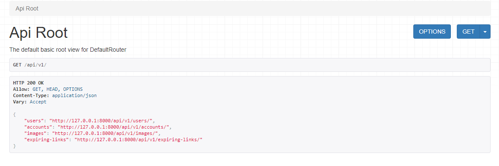
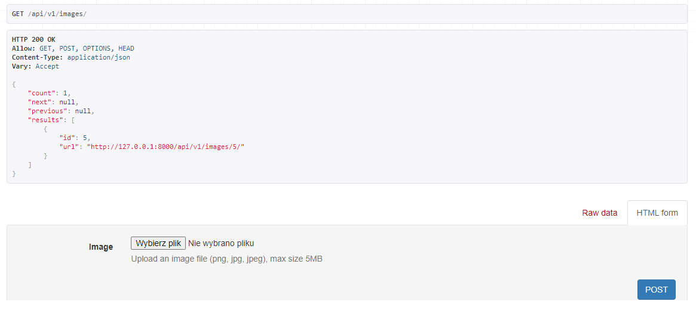
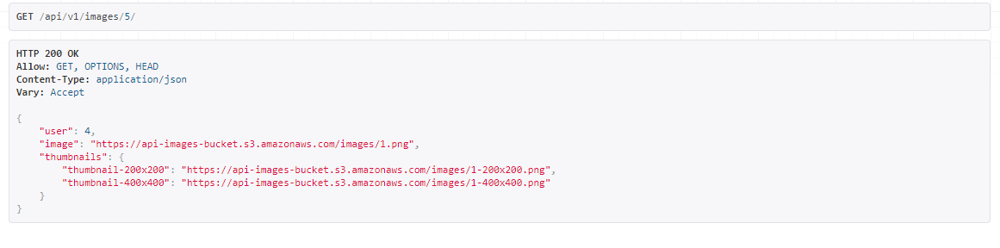
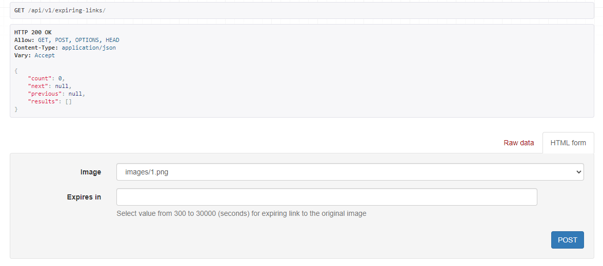
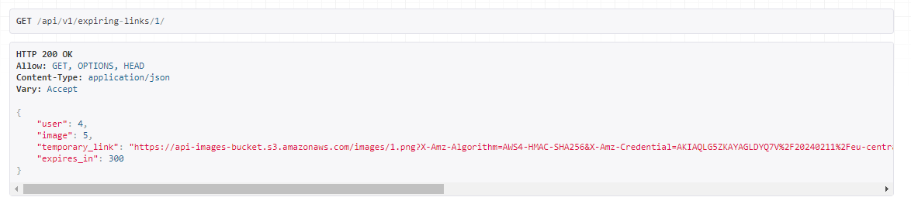

# Thumbnails API

## Description

This project is a RESTful API for creating and managing image thumbnails. It also allows for creating expiring links to the images, which can be used to provide temporary access to the original images.

Images and thumbnails are stored on AWS S3, thumbnails are generated asynchronously using Celery.

The entire application is Dockerized, which simplifies deployment and ensures consistency across different environments.

Additionally, API documentation is available via Swagger and Redoc.

## Account Tiers

This API supports three built-in account tiers: Basic, Premium, and Enterprise.

- **Basic**: Users can upload images and receive a link to a 200x200px thumbnail.

- **Premium**: In addition to the Basic tier features, users also receive a link to a 400x400px thumbnail and a link to the original image.

- **Enterprise**: In addition to the Premium tier features, users can fetch an expiring link to the image. The link can be set to expire between 300 and 30000 seconds.

## Admin Capabilities

Admin users have the ability to extend the functionality of the API. They can add new account tiers, modify the capabilities of existing tiers, and create new sizes of thumbnails.

## Usage

This API allows you to upload images and generate thumbnails. Here's a quick overview of the functionality:

1. **API Root**: The API root provides an overview of all the available endpoints:

   

2. **Upload an Image**: You can upload an image using the `/api/v1/images/` endpoint:

   

3. **Get an Image**: You can get a specific image using the `/api/v1/images/{image_id}/` endpoint:

   

4. **Make an Expiring Link**: You can make an expiring link for an image using the `/api/v1/expiring-links/` endpoint:

   

5. **Get an Expiring Link**: You can get an expiring link for an image using the `/api/v1/expiring-links/{image_id}/` endpoint:

   

## Local Installation

1. **Clone the repository**:

   ```bash
   git clone https://github.com/EWitkowska/thumbnails_api.git

   ```

2. **Navigate into the directory**:

   ```bash
   cd thumbnails_api

   ```

3. **Install the requirements**:

   ```bash
   pip install -r requirements.txt

   ```

4. **Set up the environment variables**:

   Create a `.env` file in the root directory and set the following variables.
   You can use the `.env.template` file as a starting point:

   ```bash
    SECRET_KEY=
    DEBUG=

    POSTGRES_HOST=
    POSTGRES_PORT=5432
    POSTGRES_DB=
    POSTGRES_USER=
    POSTGRES_PASSWORD=

    AWS_STORAGE_BUCKET_NAME=
    AWS_REGION=
    AWS_ACCESS_KEY_ID=
    AWS_SECRET_ACCESS_KEY=
    AWS_S3_FILE_OVERWRITE=True
    AWS_QUERYSTRING_AUTH=False

    REDIS_URL=redis://redis:6379/1
    CELERY_BROKER_URL=redis://redis:6379/1
    CELERY_RESULT_BACKEND=redis://redis:6379/1
   ```

   Please note that you need to configure AWS S3 on your own. Make sure to replace the AWS variables with your actual AWS S3 bucket name, region, access key ID, secret access key, and other settings.

5. **Run the migrations:**:

   ```bash
   python manage.py migrate

   ```

6. **Load the fixtures**:

   ```bash
   python manage.py load_fixtures

   ```

7. **Run the server**:

   ```bash
   python manage.py runserver
   ```

   Now, you can access the application at http://127.0.0.1:8000

## Docker Installation

1. **Clone the repository**:

   ```bash
   git clone https://github.com/EWitkowska/thumbnails_api.git
   ```

2. **Navigate into the directory**:

   ```bash
   cd thumbnails_api
   ```

3. **Set up the environment variables**:

   Create a `.env` file in the root directory and set the following variables.
   You can use the `.env.template` file as a starting point:

   ```bash
    SECRET_KEY=
    DEBUG=

    POSTGRES_HOST=
    POSTGRES_PORT=5432
    POSTGRES_DB=
    POSTGRES_USER=
    POSTGRES_PASSWORD=

    AWS_STORAGE_BUCKET_NAME=
    AWS_REGION=
    AWS_ACCESS_KEY_ID=
    AWS_SECRET_ACCESS_KEY=
    AWS_S3_FILE_OVERWRITE=True
    AWS_QUERYSTRING_AUTH=False

    REDIS_URL=redis://redis:6379/1
    CELERY_BROKER_URL=redis://redis:6379/1
    CELERY_RESULT_BACKEND=redis://redis:6379/1
   ```

   Please note that you need to configure AWS S3 on your own. Make sure to replace the AWS variables with your actual AWS S3 bucket name, region, access key ID, secret access key, and other settings.

4. **Build the Docker image**:

   ```bash
   docker-compose build
   ```

5. **Run the Docker containers**:

   ```bash
   docker-compose up
   ```

   Now, you can access the application at http://127.0.0.1:80

## Demo Data

For demo purposes I've added users, an admin user, and predefined thumbnail dimensions to the database.

## Demo Credentials

For the admin account - can log in to Django admin:

- **Email**: admin@example.com
- **Password**: Blank2211

For users:

- **Email**: user1@example.com
- **Password**: Blank2211

- **Email**: user2@example.com
- **Password**: Blank2211

- **Email**: user3@example.com
- **Password**: Blank2211

## API Documentation

This API uses both Swagger and Redoc for documentation and interactive exploration of the API's endpoints. You can access the Swagger and Redoc UIs at:

- **Swagger UI**:

  - **Local Installation**: [http://127.0.0.1:8000/api/v1/schema/swagger-ui/](http://127.0.0.1:8000/api/v1/schema/swagger-ui/)
  - **Docker Installation**: [http://127.0.0.1:80/api/v1/schema/swagger-ui/](http://127.0.0.1:80/api/v1/schema/swagger-ui/)

- **Redoc UI**:
  - **Local Installation**: [http://127.0.0.1:8000/api/v1/schema/redoc/](http://127.0.0.1:8000/api/v1/schema/redoc/)
  - **Docker Installation**: [http://127.0.0.1:80/api/v1/schema/redoc/](http://127.0.0.1:80/api/v1/schema/redoc/)
